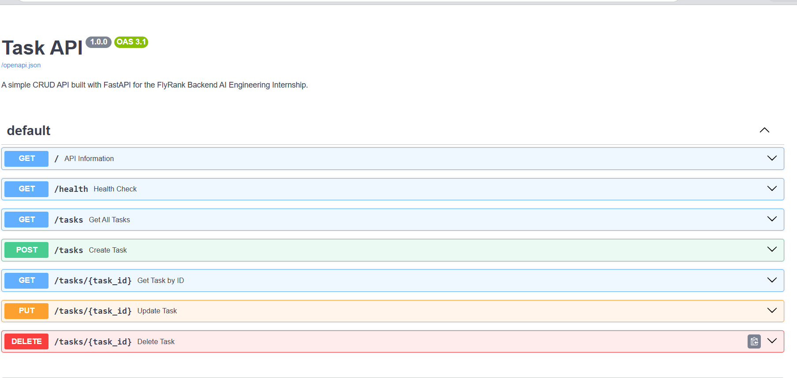

# Task API

A simple RESTful CRUD API built with **FastAPI** for the **FlyRank Backend AI Engineering Internship**.

This project demonstrates the implementation of a Task Management API using Python and FastAPI, featuring Create, Read, Update, and Delete (CRUD) operations with in-memory storage.

---

## Overview

This API allows users to manage tasks through a RESTful interface. It supports creating, retrieving, updating, and deleting tasks while demonstrating FastAPI fundamentals, request validation, status codes, and interactive API documentation.

---

## Features

- Create a new task
- Retrieve all tasks
- Retrieve a task by ID
- Update an existing task
- Delete a task
- Health check endpoint
- Interactive API documentation with Swagger UI
- Proper HTTP status codes and error handling

---

## Tech Stack

- Python 3.14
- FastAPI
- Uvicorn
- Pydantic

---

## Project Structure

```text
task-api/
├── docs/
│   └── swagger-ui.png
├── main.py
├── requirements.txt
├── README.md
└── .gitignore
```

> **Note:** The virtual environment (`venv/`) is excluded from the repository using `.gitignore`.

---

## Installation

### 1. Clone the repository

```bash
git clone https://github.com/Endurance24/task-api.git
```

### 2. Navigate into the project

```bash
cd task-api
```

### 3. Create a virtual environment

```bash
python -m venv venv
```

### 4. Activate the virtual environment

**Windows (PowerShell)**

```powershell
.\venv\Scripts\Activate.ps1
```

### 5. Install dependencies

```bash
pip install -r requirements.txt
```

### 6. Run the application

```bash
uvicorn main:app --reload
```

The API will be available at:

```
http://127.0.0.1:8000
```

---

## API Documentation

FastAPI automatically generates interactive API documentation.

**Swagger UI**

```
http://127.0.0.1:8000/docs
```

**ReDoc**

```
http://127.0.0.1:8000/redoc
```

---

## API Endpoints

| Method | Endpoint | Description |
|---------|----------|-------------|
| GET | `/` | Returns API information |
| GET | `/health` | Returns API health status |
| GET | `/tasks` | Retrieve all tasks |
| GET | `/tasks/{task_id}` | Retrieve a task by ID |
| POST | `/tasks` | Create a new task |
| PUT | `/tasks/{task_id}` | Update an existing task |
| DELETE | `/tasks/{task_id}` | Delete a task |

---

## Sample Request

### Create a Task

**POST** `/tasks`

```json
{
  "title": "Complete FlyRank Assignment"
}
```

### Sample Response

```json
{
  "id": 4,
  "title": "Complete FlyRank Assignment",
  "done": false
}
```

---

## API Preview

The screenshot below shows the interactive Swagger UI generated by FastAPI.



---

## Future Improvements

- Integrate a persistent database (SQLite or PostgreSQL)
- Add JWT authentication and user management
- Implement task filtering and search
- Add pagination for task lists
- Containerize the application with Docker
- Add automated testing with Pytest
- Deploy the API to a cloud platform such as Render or Railway

---

## Author

**Endurance Alexander**

GitHub: https://github.com/Endurance24

---

## License

This project was developed as part of the **FlyRank Backend AI Engineering Internship** technical assessment and is intended for educational and evaluation purposes.